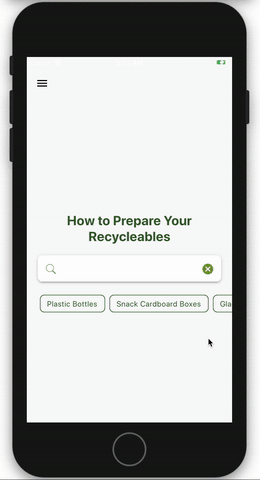

# Zero

App developed as a part of #hackcovy the first online hackathon with the goal of creating technological solutions to cope with problems caused by COVID-19 in Vietnam.

Our app gives clear instructions about recycling process, from identifying each material to guiding how to clean them properly, as well as allowing you to self-deliver or order a pick-up of your recyclable waste to nearby organizations .

